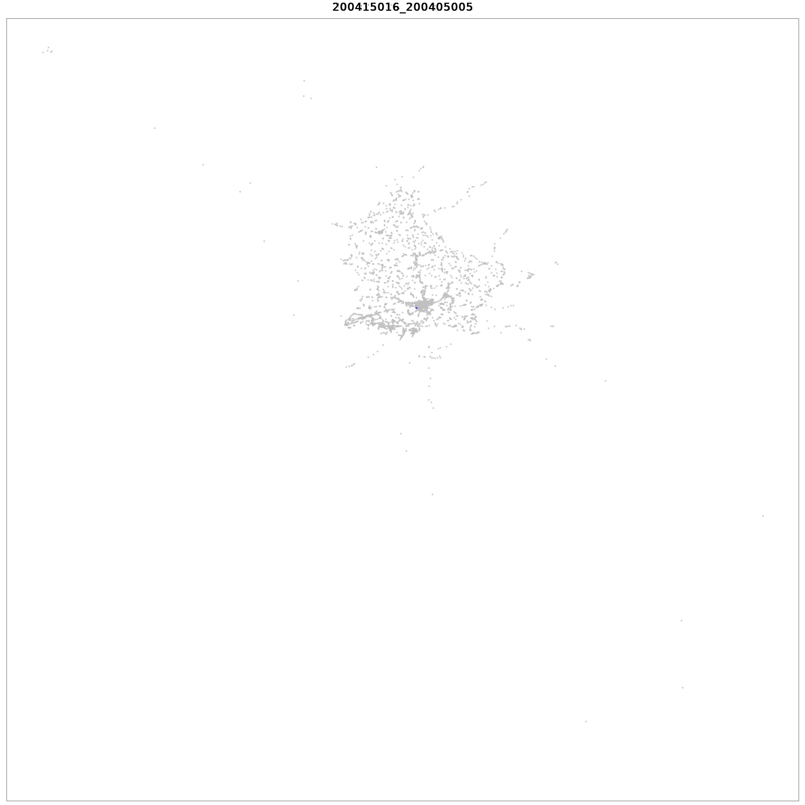
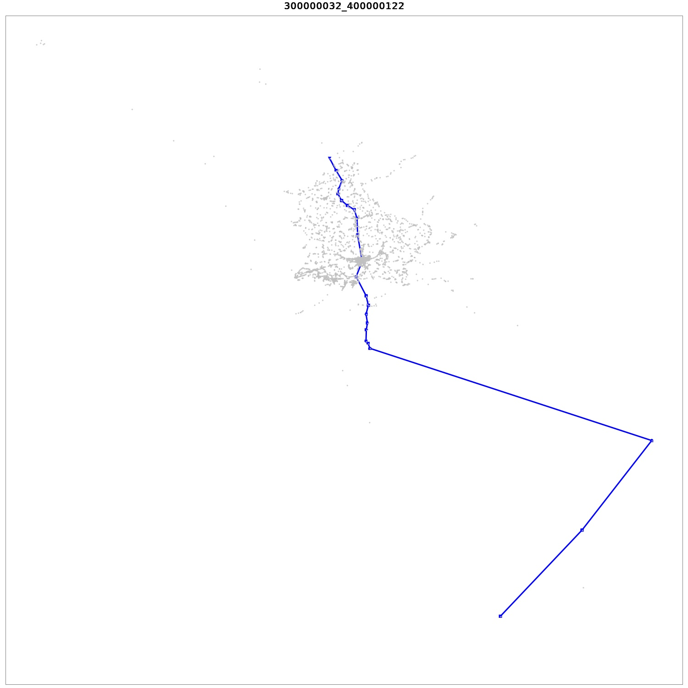

Allegro Luca 1211142

Hu Giovanni Jiayi 1206458

Mattiazzo Elena 1206695

# La rete dei trasporti pubblici

## Domanda 1

Il grafo usa una mappa dove le chiavi sono gli id delle stazioni, mentre il valore di ogni chiave è la mappa delle stazioni adiacenti con le relative corse. Ogni corsa ha come campi il nome della linea, orario di partenza e di arrivo.
Quindi i nodi sono le stazioni, mentre gli archi sono le corse da una stazione a quella adiacente.
Vi è inoltre una mappa creata in tempo di esecuzione dell'algoritmo che contiene i pesi degli archi, come il minor tempo di percorrenza in minuti dalla stazione di partenza ed in base all'orario stesso di partenza. Non è stato possibile infatti farlo staticamente perchè il tempo da un nodo A all'altro B dipende dal tempo di attesa tra una corsa e l'altra e il tempo di arrivo alla stazione A.

Inoltre nell'implementazione in A* vi è anche una mappa delle stazioni per id, con le coordinate geografiche.

## Domanda 2

Si è risolto il problema confrontando due soluzioni: Dijkstra con heap e A*. Entrambi gli algoritmi sono molto simili e cambia solo il calcolo della priorità dalla heap normale alla heap di A*. Si procede dunque a descrivere l'algoritmo implementato in comune in entrambi i casi.

I nodi sono stati divisi in visitati e non visitati come nell'algoritmo base di Dijkstra, ed in particolare il calcolo del peso verso una stazione adiacente non è statico, bensì è calcolato dinamicamente come il tempo di tragitto minimo in relazione all'orario di arrivo alla stazione corrente. La peculiarità consiste quindi nel fatto che tra tutte le possibili corse da una stazione all'altra viene considerata solo quella con tempo di arrivo minore rispetto a quello di partenza.

La coda di priorità dei nodi da visitare è implementata come una Heap.  Nell'algoritmo **non** A*, è una Heap con priorità in base alla distanza temporale minima (in minuti) dalla stazione di partenza. Nel caso A* invece tiene in conto anche dell'euristica, ovvero la distanza geografica tra il nodo non visitato e la destinazione finale. Quindi in quest'ultimo caso la priorità è data da `distanza_temporale_dalla_partenza + distanza_geografica_verso_destinazione`.

### Analisi dell'euristica

L'euristica utilizzata è la seguente:

```
velocità = 120; // max(velocità_bus, velocità_treno)
minutiInOra = 60;
euristica = distanza_verso_destinazione / velocità * minutiInOra
```

Tuttavia è stata notata la seguente difficoltà:

L'euristica deve essere ammissibile per cui la velocità considerata è quella dei treni che è il mezzo più veloce, tuttavia i valori ottenuti diventano insignificanti in quanto gli autobus sono la maggioranza dei viaggi. 

Di conseguenza quindi i tempi di calcolo di A* peggiorano solo rispetto ad una normale heap senza euristica a causa dell'overhead. Nelle esecuzioni effettuate si nota difatti un'esecuzione nettamente più celere rispetto allo heap normale solo nel caso seguente, in cui analizzando i dati della corsa si vede che il mezzo preso è un treno. In questo caso l'euristica diventa significativa ed il tempo di esecuzione è nettamente minore.

```
Viaggio da 200417051 a 140701016
Orario di partenza: 12:00
Orario di arrivo: 12:43
12:20 -  12:43 : corsa 03712 C82--- da 200417051 a 140701016
Execution with heap: 31
Execution with A*: 15
```

## Domanda 3

I tempi di esecuzione sono i seguenti:


```
Viaggio da 500000079 a 300000044
Orario di partenza: 13:00
Orario di arrivo: 17:18
13:46 -  14:41 : corsa 06171 CFLBUS da 500000079 a 200405036
14:47 -  15:27 : corsa 06312 CFLBUS da 200405036 a 300000003
15:31 -  17:18 : corsa 02138 C82--- da 300000003 a 300000044
Execution with heap: 57
Execution with A*: 68
```

```
Viaggio da 200415016 a 200405005
Orario di partenza: 09:30
Orario di arrivo: 09:52
09:30 -  09:44 : corsa 00360 RGTR-- da 200415016 a 200405020
09:50 -  09:52 : corsa 06602 RGTR-- da 200405020 a 200405005
Execution with heap: 4
Execution with A*: 9
```

```
Viaggio da 300000032 a 400000122
Orario di partenza: 05:30
Orario di arrivo: 13:50
06:26 -  07:25 : corsa 07608 C88--- da 300000032 a 160904001
07:26 -  07:43 : corsa 03781 C82--- da 160904001 a 200405035
07:46 -  08:44 : corsa 00055 C82--- da 200405035 a 400000047
12:07 -  13:50 : corsa 09879 C82--- da 400000047 a 400000122
Execution with heap: 34
Execution with A*: 37
```

```
Viaggio da 210602003 a 300000030
Orario di partenza: 06:30
Orario di arrivo: 10:53
06:41 -  06:54 : corsa 00030 CFLBUS da 210602003 a 210502001
06:55 -  07:07 : corsa 00031 CFLBUS da 210502001 a 201103004
07:07 -  07:19 : corsa 01306 CFLBUS da 201103004 a 200404016
07:20 -  07:23 : corsa 00031 CFLBUS da 200404016 a 200405036
07:24 -  07:26 : corsa 01173 RGTR-- da 200405036 a 200405026
07:27 -  07:29 : corsa 04301 AVL--- da 200405026 a 200405035
07:40 -  10:53 : corsa 07630 C82--- da 200405035 a 300000030
Execution with heap: 32
Execution with A*: 41
```

```
Viaggio da 200417051 a 140701016
Orario di partenza: 12:00
Orario di arrivo: 12:43
12:20 -  12:43 : corsa 03712 C82--- da 200417051 a 140701016
Execution with heap: 31
Execution with A*: 15
```

```
Viaggio da 200415009 a 170402007
Orario di partenza: 03:00
Orario di arrivo: 07:11
05:06 -  05:22 : corsa 01571 AVL--- da 200415009 a 200405026
05:24 -  05:26 : corsa 01410 AVL--- da 200405026 a 200405035
05:44 -  06:13 : corsa 03805 C82--- da 200405035 a 140701016
06:15 -  06:21 : corsa 07474 RGTR-- da 140701016 a 141301002
06:23 -  06:30 : corsa 01631 RGTR-- da 141301002 a 140503001
06:34 -  06:43 : corsa 01463 RGTR-- da 140503001 a 160601005
06:43 -  06:50 : corsa 01631 RGTR-- da 160601005 a 170801002
07:04 -  07:11 : corsa 08490 RGTR-- da 170801002 a 170402007
Execution with heap: 32
Execution with A*: 42
```

```
Viaggio da 221201005 a 170402007
Orario di partenza: 22:00
Orario di arrivo: 06:47
22:05 -  22:35 : corsa 02344 RGTR-- da 221201005 a 200405036
22:40 -  23:23 : corsa 00460 CFLBUS da 200405036 a 170402002
06:44 -  06:47 : corsa 08466 RGTR-- da 170402002 a 170402007
Execution with heap: 34
Execution with A*: 30
```

```
Viaggio da 300000032 a 150606008
Orario di partenza: 22:00
Orario di arrivo: 07:04
05:26 -  06:13 : corsa 07606 C88--- da 300000032 a 140701016
06:15 -  06:23 : corsa 07474 RGTR-- da 140701016 a 141301007
06:25 -  06:49 : corsa 06016 RGTR-- da 141301007 a 150106004
06:59 -  07:04 : corsa 00041 RGTR-- da 150106004 a 150606008
Execution with heap: 15
Execution with A*: 13
```

```
Viaggio da 170801002 a 220402034
Orario di partenza: 22:00
Orario di arrivo: 06:15
22:40 -  23:09 : corsa 09079 RGTR-- da 170801002 a 170301004
23:09 -  23:15 : corsa 06741 CFLBUS da 170301004 a 170402003
23:24 -  23:31 : corsa 00274 CFLBUS da 170402003 a 170501012
04:57 -  05:13 : corsa 00820 RGTR-- da 170501012 a 180511009
05:18 -  05:19 : corsa 00432 CFLBUS da 180511009 a 180508004
05:19 -  05:35 : corsa 00374 CFLBUS da 180508004 a 200405005
05:35 -  05:42 : corsa 06665 RGTR-- da 200405005 a 200405035
05:46 -  05:55 : corsa 00067 C82--- da 200405035 a 220102005
06:03 -  06:15 : corsa 06955 C82--- da 220102005 a 220402034
Execution with heap: 19
Execution with A*: 18
```

## Domanda 4

Le soluzioni sembrano ottimali confrontate con i risultati di Google Maps. Durante l'implementazione è stato notato inizialmente il fatto che in alcuni casi, tra soluzioni equivalenti, venisse scelta una con tanti cambi di corse appartenenti a linee diverse. Per tale motivo, nella scelta della corsa ottimale, viene tenuto anche conto del fatto di poter rimanere sullo stesso mezzo qualora i tempi di arrivi siano uguali tra due corse diverse. 

